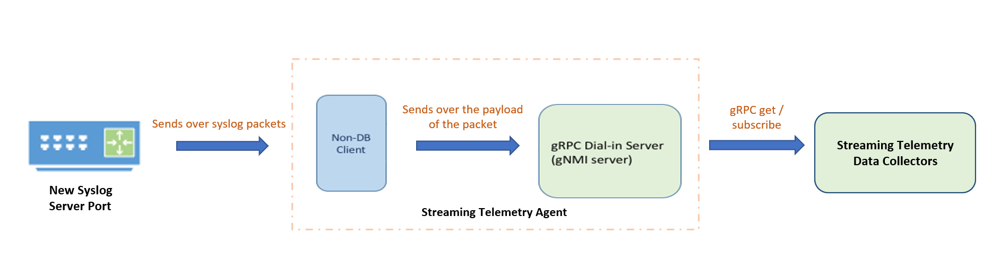
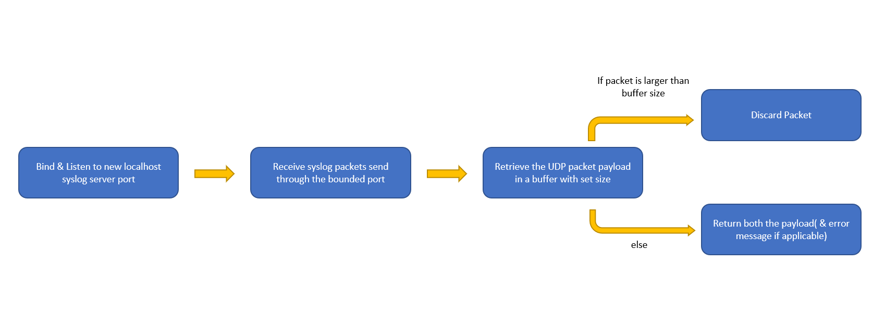

# SONiC Telemetry Syslog Pipeline
* [Overview](#overview)
   * [Purpose](#purpose)
   * [Syslog Extraction Method](#syslog-extraction-method)
* [Pipeline Design](#pipeline-design)
* [Design Implementation](#design-implementation)
         
# Overview 
## Purpose:
To replace the original syslog pipeline to allow a secure transfer of syslog information from the SONiC device using the streaming telemetry servive to the client.

## Syslog Extraction Method
There were two methods considered for extracting the syslogs from the device to be available to the streaming telemetry service:

* Method 1: Reading the information directly from the log files (/var/log/syslog*)
* Method 2: Streaming the syslog updates from the device's syslog server

Method 2 was chosen to proceed with due it ability to bypass the log rotate issue and lessened CPU time. 

# Pipeline Design

 

The syslog messages are sent to the telemetry service through a newly created syslog server port. The messages are taken to the gRPC server where it is forwarded to the collector service. 

**The gMNI server will receive the syslog information utilizing streaming mode through the OTHERS database.**

# Design Implementation
In order to create this new functionality, A function and data set path was added to the [non-db client](/sonic-data-client/non_db_client.go).

This new function was created in order to retrieve and read messages from the syslog server as demonstrated through the following flowchart:

 

